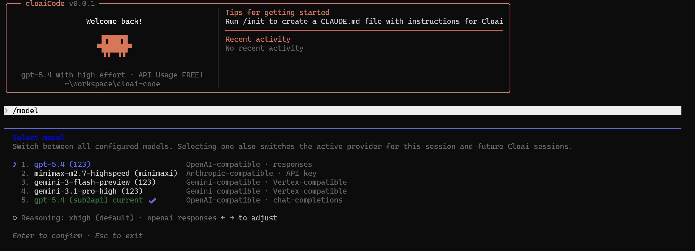

# cloaiCode

<div align="center">
  
  <h1>cloaiCode</h1>
  <p><strong>面向多 Provider 原生接入增强的代码助手 CLI。</strong></p>
  <p>重点解决第三方模型接入、配置隔离、代理环境与无头终端使用体验。</p>
  <p>
    
    
    
    
  </p>
</div>

`cloaiCode` 是一个围绕多 Provider 原生接入持续增强的 CLI 分支。它的目标不是“在外面套一层切换器”，而是把 Provider 选择、鉴权、模型切换和协议适配直接做进 CLI，自带独立配置目录，适合本地开发、远程 SSH、容器和公司代理环境。

## 核心能力

- 原生多 Provider：支持 Anthropic-compatible、OpenAI-compatible、Gemini-compatible。
- 鉴权隔离：按 `Provider + authMode` 持久化，避免串配置、串 Token。
- 独立配置目录：默认使用 `~/.cloai`，可与原版 `claude` 并存。
- OpenAI 深度兼容：支持 `Chat Completions`、`Responses`、`OAuth`。
- 终端友好：更适合服务器、无桌面环境和通过代理访问模型的场景。

## 已验证接入

| Provider 路线 | 已验证模型 | 接入方式 |
| --- | --- | --- |
| OpenAI-compatible | `gpt-5.4` | `Chat Completions` / `Responses` / `OAuth` |
| Anthropic-compatible | `minimax-m2.7-highspeed` | Claude 风格兼容网关 |
| Gemini-compatible | `gemini-3-flash-preview` / `gemini-3.1-pro-high` | Gemini 风格兼容网关 |

说明：

- OpenAI 线路已经验证 `gpt-5.4` 可正常交互。
- `Responses API` 支持缓存命中，兼容 `prompt_cache_key`。
- 公开分发版本不再内置 Gemini OAuth client id / secret；如需 Gemini CLI OAuth，请自行提供环境变量 `GEMINI_OAUTH_CLIENT_ID` 和 `GEMINI_OAUTH_CLIENT_SECRET`。

## 快速开始

环境要求：

- `bun >= 1.3.5`
- `node >= 24`

安装：

```bash
git clone <your-repo-url>
cd cloai-code
bun install
bun link
cloai
```

常用命令：

- 开发模式：`bun run dev`
- 全局启动：`cloai`
- 查看版本：`bun run version`

## 独立 OpenAI 部署

如果你想把 `cloai` 当成独立 OpenAI CLI 使用，并且不影响原版 `claude`，推荐直接按这份文档配置：

- [docs/OPENAI_SETUP_CN.md](docs/OPENAI_SETUP_CN.md)

这套部署方案的目标是：

- 默认走 `OpenAI / gpt-5.4`
- 使用独立配置目录 `~/.cloai`
- 不复用原版 `claude` 的 AWS Bedrock 配置
- 兼容公司代理场景
- 解决 `~/.bun/bin/cloai` 抢命中的问题

推荐流程：

1. 按文档创建包装脚本和 `~/.cloai/launch-settings.json`
2. 执行 `codex login` 后，在 `cloai` 中运行 `/import-codex`
3. 从 `~/` 启动 `cloai`，确认顶部模型显示为 `gpt-5.4`
4. 发送 `Reply with exactly OK.` 验证链路是否通畅

## 与原版 `claude` 的关系

默认情况下，两者可以并存：

- `cloai` 使用 `~/.cloai`
- 原版 `claude` 可继续使用 `~/.claude`
- 包装脚本只影响 `cloai`

如果你已经在原版 `claude` 中配置了企业 AWS Bedrock，这套独立 OpenAI 接入方案不会主动迁移或覆盖那部分设置。

## 近期更新

更新于 `2026-04-08`：

- 支持 `Responses API` 缓存命中，降低成本并提升响应速度
- 修复 `IP + 端口` 形式 `Base URL` 被错误降级为 Anthropic 路径的问题
- 修复多轮工具调用与 Plan Mode 自动切换场景下的请求失败问题
- 增补独立 OpenAI 接入与隔离部署文档
- 公开分发版本移除了 Gemini OAuth 内置凭据，改为环境变量注入

## 适用场景

- 需要把第三方模型直接接进 CLI，而不是依赖外部切换器
- 同时维护多套 Provider、不同认证方式和不同网关
- 希望在 SSH、容器、远程开发机等无头环境稳定使用
- 需要把 `cloai` 与原版 `claude` 隔离运行
- 公司网络或代理环境对证书链有特殊要求

## 免责声明

- 本项目是非官方分支，不代表任何官方立场。
- 项目会持续演进；不同 Provider 的冷门边界情况仍可能继续调整。
- 使用第三方网关、代理或自建服务时，请自行评估合规性与安全性。

## 致谢

- 参考项目：[doge-code](https://github.com/HELPMEEADICE/doge-code)
